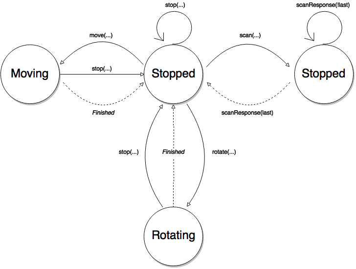

# Commands:
#### Motor Commands
```
Command => Response
-------------------
move (id, angle, magnitude) => moveResponse (id, angle, magnitude, reason)
stop (id)                   => stopResponse (id, angle, magnitude, reason)
rotate (angle)              => rotateResponse (id, angle, reason)

Parameters Explained:
  - 'id'        => id of instruction (Unique so it can be identified at any point in time)
  - 'angle'     => angle measured in degrees
  - 'magnitude' => distance to move in cm
  - 'reason'    => reason for end of command. (Succesfully Finished, Crashed into Object, etc)
```

#### Lazer Commands
```
Command => Response
-------------------
scan (id) => scanResponse (id, degree, distance, last)

Comments:
  - when 'scan' is called the 'scanResponse' will be sent back up to 360 times. (End denoted by 'last' parameter)
  
Parameters Explained:
  - 'id'        => id of instruction (Unique so it can be identified at any point in time)
  - 'degree'    => current angle of the laser measured in degrees
  - 'distance'  => distance recorded by laser
  - 'last'      => boolean, true if last piece of data to be sent for current request. 
```

#### Compass Commands
```
Command => Response
-------------------
getHeading (id) => compassResponse (id, degree)
  
Parameters Explained:
  - 'id'        => id of instruction (Unique so it can be identified at any point in time)
  - 'degree'    => current heading of the compass in degrees. North = 0 degrees.
```

#### State Flow-Chart

